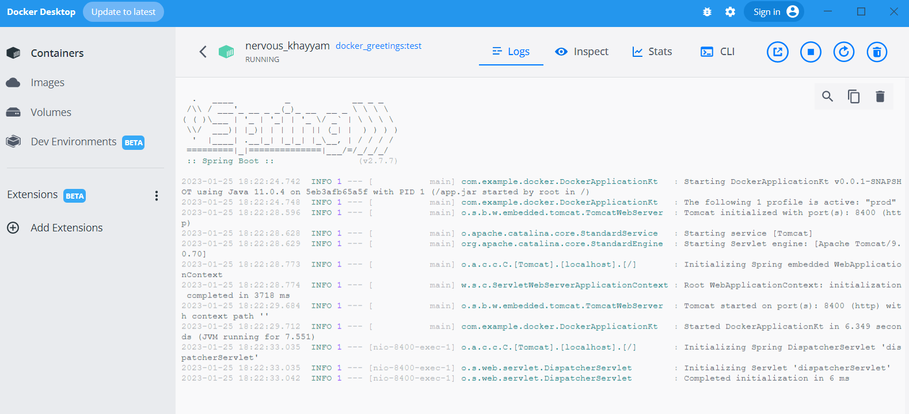

Docker

1) Реализовать Dockerfile (сам файл создан пустым и лежит в корне проекта - Dockerfile)

- ваш образ можно базировать на openjdk:8-jdk-alpine
- ваше приложение умеет работать с разными профилями, необходимо в Dockerfile поддержать возможность прокидывать
  активный профиль в качестве параметра

2) Собрать образ на основе созданного Dockerfile.
3) Запустить контейнер и передать в него в качестве параметра выбранный профиль: qa или prod.
4) Вызвать GET-метод класса Controller, чтобы убедиться, что приложение успешно стартовало с выбранным профилем.
   Обратите внимание, что до контейнера можно добраться с локальной машины, если у него открыты определенные порты в
   Dockerfile и вы не забыли сделать порт-маппинг при старте контейнера. Ожидаемый результат ответа API-метода: "
   PRODUCTION!" и "QA!" для соответствующих профилей.
5) Команды для сборки образа и старта контейнера можно найти в видеолекции.

## Комментарий от слушателя курса
1) Собрал образ в два этапа: сборка минимального JDK и сборка собственно приложения. Полученный образ
весит 79.21 МВ, что вроде как весьма неплохо для java.
2) Прокинул порт 8400, запускал с параметрами SPRING_PROFILES_ACTIVE=qa и =prod. Результаты:
   
   
   

Kubernetes (необязательное задание)

1) Реализовать definition-файл (сам файл создан пустым и лежит в корне проекта - deployment-definition.yml) деплоймента
   на основе образа данного приложения.
2) Соответственно необходимо проверить его работоспособность: приложение должно запускаться и масштабироваться.
3) Проверить его работоспособность можно - установив себе локально minikube.